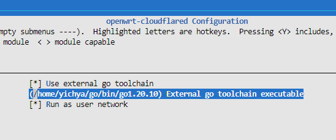

# cloudflared for OpenWrt

Really convenient for exposing services behind NAT.

See [https://developers.cloudflare.com/cloudflare-one/connections/connect-apps](https://developers.cloudflare.com/cloudflare-one/connections/connect-apps) for details.

Note that you are supposed to move configuration files from `/root/.cloudflared` to `/etc/cloudflared` once you have finished tunnel setup.

## Compile using external go toolchain

Cloudflared currently depends on a customized version of quic-go for some post-quantum encryption methods and it needs certain versions of go toolchain to build. 

You can specify another go executable (for example `~/go/bin/go1.20.10`, installed by `go install golang.org/dl/go1.20.10@latest && go1.20.10 download`) to avoid using toolchains provided with OpenWrt.

## Todo

* [ ] DNS over HTTPS proxy server
* [ ] Access ([https://developers.cloudflare.com/cloudflare-one/applications/non-http](https://developers.cloudflare.com/cloudflare-one/applications/non-http))
* [ ] LuCI
